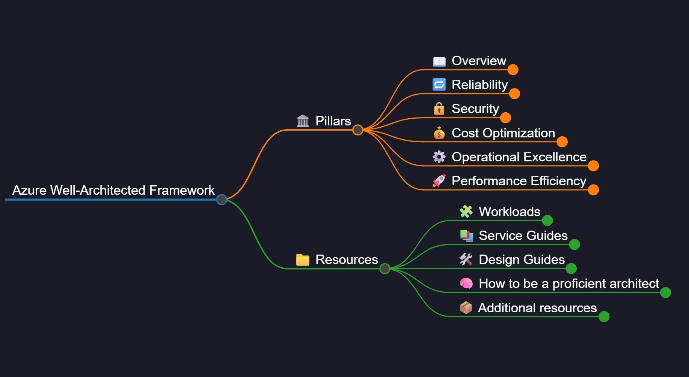
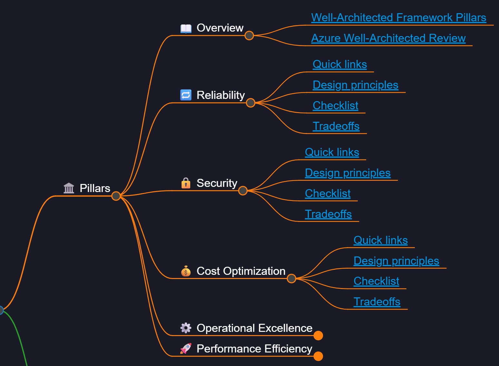

# 🗺️ Dan’s Azure WAF Markmap

Welcome to **Dan’s Azure WAF Markmap** - an open, visual, and structured reference map of key concepts from the [**Microsoft Azure Well-Architected Framework**](https://learn.microsoft.com/en-us/azure/cloud-adoption-framework/).

This resource is built using [**Markmap**](https://markmap.js.org/), a JavaScript-powered tool that turns Markdown lists into **interactive mind maps**. The result is a dynamic, explorable way to understand and organize terminology across a broad AI landscape - from foundational learning paradigms to Microsoft-specific AI services.

<a href="https://azure-waf.daniel.mcloughlin.cloud/" target="_blank">
  
</a>

---

## 📝 Microsoft Azure Well-Architected Framework - Executive Summary

For a concise overview of the Azure Well-Architected Framework and each of its key Methodologies, see the [Executive Summary](./azure-waf-exec-summary.md) file.

This summary is ideal for newcomers or stakeholders who need to understand the big picture without digging into the full documentation. It explains what WAF is, why it matters, and what each phase covers - including strategy, planning, adoption, governance, security, and ongoing management.

---

## 📚 Further Reading
If you're looking to better understand why the Azure Well-Architected Framework matters and how it fits into the broader cloud transformation journey, check out this article from the Azure Architecture team:

👉 [Why you need a Cloud Adoption Framework (CAF)... and probably a WAF too](https://techcommunity.microsoft.com/blog/azurearchitectureblog/why-you-need-a-cloud-adoption-framework-caf-and-probably-a-waf-too/3667426)
> Published on Microsoft Tech Community

This piece provides insight into how CAF supports structure and accountability in cloud journeys - and why governance (and sometimes a "WAF") shouldn't be an afterthought.

---

## 🎯 About This Project

I've built this project because I'm a visual learner, and while the Microsoft documentation for the Microsoft Azure Well-Architected Framework (WAF) is excellent and comprehensive, the sheer volume of information can be overwhelming. Visualising the framework in an interactive map helps me better understand the structure, flow, and relationships between its components.

By making this project open, I hope others can benefit from this format too - whether you're just beginning your cloud journey or looking for a clearer way to communicate WAF principles to your team.

> Note: All content and links are accurate as of **24 June 2025**. I’ll review and update periodically - pull requests are welcome!

> **Disclaimer:** This project is not affiliated with or endorsed by Microsoft. All content and intellectual property referenced belong to Microsoft. I'm simply building a free and useful visual tool around the excellent work they've already done.

---

### Screenshots
<p align="center">
  
</p>
<p align="center">
  
</p>

---

## 🧠 What You'll Find

- A fully interactive [Markmap](https://markmap.js.org) visualisation of the Azure WAF
- Structured links to official Microsoft Learn documentation
- Sections aligned to the WAF methodology: Strategy, Plan, Ready, Adopt, Govern, Secure, Manage
- Tools, templates, and resource references by phase
- Helpful hierarchy and grouping to reduce overwhelm and improve navigation
  
---

## 📈 Visual Format

All terminology is structured in a Markdown file, which is rendered visually using **Markmap**.

You can:
- View it interactively in the browser
- Navigate through the hierarchy
- Expand/collapse terms as needed

---

## 🤝 Community Contributions

Feel free to:
- Suggest new terms or definitions
- Submit pull requests for corrections or additions
- Help grow the visual map

---

## 🪪 License

This project is licensed under the **MIT License** - you're free to use, share, remix, and build upon it, as long as attribution is given.

--- 

## 🛠 How It's Built

This project uses [Markmap](https://markmap.js.org) to convert a Markdown list into an interactive mind map.  
After exporting the map, a custom **post-processing script** applies visual enhancements including:

- Dark mode theme
- Custom font and header
- White text and dark background for readability
- A favicon
- Branding and blog link

---

## ⚙️ Setup Instructions

Install the Markmap CLI (if not already installed):

```bash
npm install -g markmap-cli
```

Then run this command from the root of the repo:

```bash
npx markmap-cli markmap.md -o ./docs/index.html --no-open && node postprocess-map.js
```

This generates the visual map and applies styling in one go.

---

## 🔗 Link Checker

This project includes a `check-links.js` script that scans all external links in `markmap.md` to:

- Identify broken or redirected URLs
- Report any issues in a dedicated `broken-links.log` file
- Help maintain high-quality, up-to-date reference links for learners

### ✅ Why this exists:
Because this tracker is intended to be long-lived and reliable, it's important to regularly check that:
- All links point to official and active sources (e.g., Microsoft Learn, Wikipedia, GitHub)
- There are no outdated, redirected, or dead references in the mind map

### ▶️ How to run it:

```bash
node check-links.js
```

This will:
- Output results to the terminal (with ✅ and ❌ indicators)
- Write any issues to `broken-links.log` for review
- Automatically clear the log if no issues are found

---

## 🌐 Why the `/docs` Folder?

The `docs` folder is used because GitHub Pages has been configured to serve static content from it.  
The `index.html` is published at:

📍 `https://clouddevdan.github.io/azure-waf-markmap/index.html`